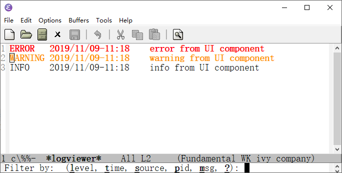

# listv
Emacs list view

# Features
1. support item text property, so you can highlight some list item
2. toggle visibility of item field
3. filter item by field

# Usage
`
;; Here we use listv to implement a log viewer
(with-current-buffer buffer
  (listv-init-buffer '(level time source pid msg) '(?l ?t ?s ?p ?m) '(level time msg))
  (listv-append-item (cons '(face error) '(level "ERROR" time "2019/11/09-11:18" source "UI" pid "1990" msg "error from UI component")))
  (listv-append-item (cons '(face warning) '(level "WARNING" time "2019/11/09-11:18" source "UI" pid "1990" msg "warning from UI component")))
  (listv-append-item (cons nil '(level "INFO" time "2019/11/09-11:18" source "UI" pid "1990" msg "info from UI component")))
  )
`
# GUI demo

